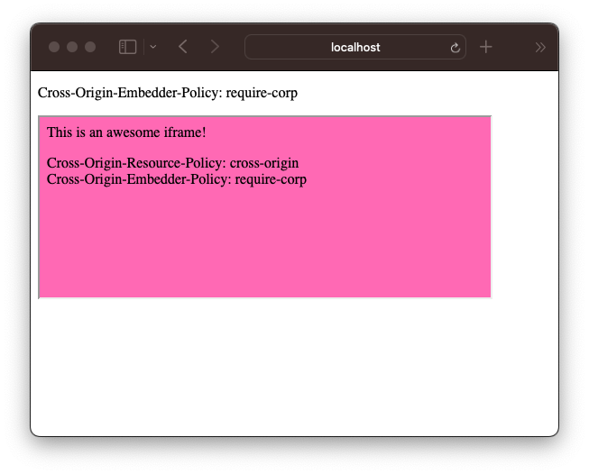
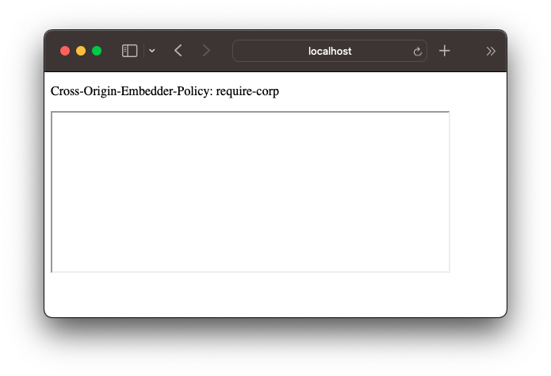
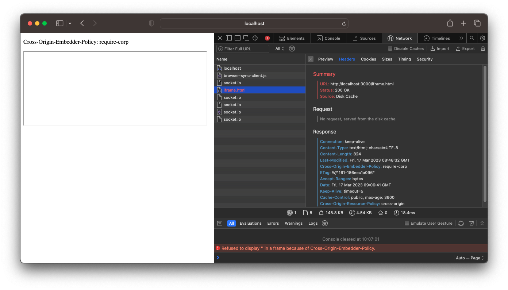

# WebKit iFrame COEP Disk Cache bug

This bug might manifest in other scenario's as well, but I found it when embedding iframes.

You can follow along by cloning this repository, installing the dependencies and running the `start` command. The website will be hosted on http://localhost:3000.

```
npm install && npm start
```

## Scenario

A page which defines `COEP: require-corp` wants to embed an iframe. The iframe specifies `CORP: cross-origin`.



This works because the iframe indicates the `CORP: cross-origin` header. For this test it could've been `same-origin` as well because they are hosted on the same domain, but in my real-world use cases these are different domains.

The iframe is also served with `Cache-Control: public, max-age=3600` to make sure the browser caches the resource.

## Issue

When refreshing the page, everything still works. Closing the browser window with the red `X` in the top left, re-opening it and opening the web page again also works. This is probably due to the fact that the `iframe.html` resource is then loaded from `Memory Cache`, and not from `Disk `Cache`.

However, when quitting the browser entirely with <kbd>⌘</kbd> <kbd>Q</kbd>, re-opening it and opening the web page again, breaks. The iframe will not be loaded.



When taking a closer look at the DevTools we see the error

> Refused to display '' in a frame because of Cross-Origin-Embedder-Policy.

Refreshing the page with DevTools open sometimes fixes the issue. But it seems to only fix it if the `iframe.html` resources is loaded from `Memory Cache`. In the scenario where it's loaded from `Disk Cache`, it seems that the `CORP` header from the resource is not taken into account. This is probably the reason why the behaviour is different when quitting Safari entirely, because then the resource doesn't live in memory anymore.

 

## Additional Information

Bug is tracked https://bugs.webkit.org/show_bug.cgi?id=254065.

- COEP is implemented by [cdumez](https://github.com/cdumez) in https://github.com/WebKit/WebKit/commit/e6c7e17d32fa0dd802337c7f0d2c63b0703b782a
- There seemed to be an issue with the COEP header and script cache hits which was fixed by [cdumez](https://github.com/cdumez) in https://github.com/WebKit/WebKit/pull/5141
